# 402md Facilitator

Cross-chain USDC settlement provider for agentic payments. Buyer pays on any chain, seller receives on their preferred chain. One HTTP request.

Dual-protocol support: [x402](https://www.x402.org/) (Coinbase) and [MPP](https://www.machinepayments.com/) (Stripe + Tempo). Settlement via [Circle CCTP V2](https://www.circle.com/cross-chain-transfer-protocol) — native USDC everywhere, zero slippage, zero wrapped tokens.

## How It Works

```
Buyer (any chain)                         Seller (their chain)
       │                                         ▲
       │  1. HTTP 402 + payment                  │  4. USDC arrives
       ▼                                         │
   ┌────────┐     2. verify      ┌────────┐     │
   │ Relay  │ ──────────────────▶│ Worker │─────┘
   │(Elysia)│     3. settle      │(Temporal)
   └────────┘                    └────────┘
       │                              │
       └──────── PostgreSQL ──────────┘
                   Redis
```

### x402 Cross-Chain Settlement (via Circle CCTP V2)

```mermaid
sequenceDiagram
    participant Agent as AI Agent (Solana)
    participant Seller as Seller API (Base)
    participant Relay as 402md Relay
    participant Worker as 402md Worker
    participant Source as Source Chain (Solana)
    participant CCTP as Circle CCTP V2
    participant Dest as Dest Chain (Base)

    Agent->>Seller: GET /weather
    Seller-->>Agent: 402 Payment Required (accepts: Solana, Base, Stellar)

    Note over Agent: Signs USDC authorization<br/>to facilitator address on Solana

    Agent->>Seller: GET /weather + payment header
    Seller->>Relay: POST /verify (paymentPayload + merchantId)
    Relay-->>Seller: { isValid: true } ~ms
    Seller-->>Agent: 200 OK + resource

    Note over Agent: Agent has resource.<br/>Settlement happens async ↓

    Seller->>Relay: POST /settle (paymentPayload + merchantId)
    Relay->>Worker: startWorkflow(crossChainSettle)

    rect rgb(45, 50, 60)
        Note over Worker,Dest: Temporal Workflow — crossChainSettle
        Worker->>Source: 1. pullFromBuyer — $1.00 USDC
        Source-->>Worker: ✓ pull tx confirmed
        Note over Worker: 2. Retain gas allowance ($0.0012)
        Worker->>Source: 3. CCTP burn — $0.9988 (mintRecipient = seller)
        Source-->>Worker: ✓ burn tx confirmed
        Worker->>CCTP: 4. waitAttestation (poll Circle API)
        Note over CCTP: Source chain reaches finality<br/>~25s Solana · ~5s Stellar · ~15min EVM
        CCTP-->>Worker: ✓ attestation received
        Worker->>Dest: 5. CCTP mint — $0.9988 to seller on Base
        Dest-->>Worker: ✓ mint tx confirmed
        Worker->>Worker: 6. Record in ledger
    end
```



### x402 Same-Chain Settlement

```mermaid
sequenceDiagram
    participant Agent as AI Agent (Base)
    participant Seller as Seller API (Base)
    participant Relay as 402md Relay
    participant Worker as 402md Worker
    participant Chain as Base

    Agent->>Seller: GET /weather
    Seller-->>Agent: 402 Payment Required

    Agent->>Seller: GET /weather + payment header
    Seller->>Relay: POST /verify
    Relay-->>Seller: { isValid: true } ~ms
    Seller-->>Agent: 200 OK + resource

    Seller->>Relay: POST /settle
    Relay->>Worker: startWorkflow(sameChainSettle)

    rect rgb(45, 50, 60)
        Note over Worker,Chain: Temporal Workflow — sameChainSettle
        Worker->>Chain: 1. pullFromBuyer — $1.00 USDC
        Note over Worker: 2. Deduct gas allowance + platform fee
        Worker->>Chain: 3. Transfer net USDC to seller
        Worker->>Worker: 4. Record in ledger
    end
```



### MPP Cross-Chain Settlement

```mermaid
sequenceDiagram
    participant Agent as AI Agent
    participant Service as MPP Service
    participant Relay as 402md Relay
    participant Worker as 402md Worker
    participant Source as Source Chain
    participant CCTP as Circle CCTP V2
    participant Dest as Seller's Chain

    Agent->>Service: Request resource
    Service-->>Agent: 402 + MPP payment methods (incl. 402md)

    Agent->>Source: Broadcast USDC tx to facilitator address
    Note over Agent: MPP = push mode<br/>buyer pays gas directly

    Agent->>Relay: POST /mpp/settle (txHash + merchantId)

    rect rgb(45, 50, 60)
        Note over Worker,Dest: Temporal Workflow — crossChainSettle
        Relay->>Worker: startWorkflow()
        Worker->>Source: Verify incoming tx
        Worker->>Source: CCTP burn (net amount)
        Worker->>CCTP: waitAttestation
        CCTP-->>Worker: ✓ attestation
        Worker->>Dest: CCTP mint to seller
        Worker->>Worker: Record in ledger
    end

    Relay-->>Service: { settled: true }
    Service-->>Agent: 200 OK + resource
```



### Settlement Times by Chain Pair

| Origin                | Destination | Time       |
| --------------------- | ----------- | ---------- |
| Solana → Base/Stellar |             | ~25-30s    |
| Stellar → Base/Solana |             | ~5-10s     |
| Base → Solana/Stellar |             | ~15-19 min |
| EVM → EVM             |             | ~15-19 min |

> Time is dominated by source chain finality. Circle issues the attestation after hard finality; the destination mint is near-instant.

## Seller DX

No dashboard, no login, no SDK. One curl to start receiving cross-chain USDC:

```bash
curl -X POST https://api.402md.com/register \
  -d '{"walletAddress":"0x...", "network":"base"}'
```

Seller uses the standard `@x402/express` SDK from Coinbase — zero 402md dependencies.

## Monorepo Structure

```
packages/
├── relay/     @402md/relay   — HTTP API (Elysia/Bun)
├── worker/    @402md/worker  — Settlement workflows (Temporal/Node.js)
└── mpp/       @402md/mpp     — MPP payment method plugin
test/
└── e2e/       End-to-end tests
docs/
└── plans/     Implementation plans
```

| Package  | Runtime | Framework    | Purpose                                                                |
| -------- | ------- | ------------ | ---------------------------------------------------------------------- |
| `relay`  | Bun     | Elysia.js    | HTTP API, seller registration, payment verification, Temporal dispatch |
| `worker` | Node.js | Temporal SDK | On-chain settlement: pull, CCTP burn/mint, ledger                      |
| `mpp`    | Node.js | —            | MPP payment method spec for cross-chain USDC                           |

> Worker uses Node.js because the Temporal SDK requires native modules incompatible with Bun.

## Prerequisites

- [Bun](https://bun.sh/) (latest)
- [Node.js](https://nodejs.org/) 20+
- [Docker](https://www.docker.com/) (for local infrastructure)

## Getting Started

Start local infrastructure (PostgreSQL, Redis, Temporal):

```bash
docker compose up -d
```

Install dependencies and build all packages:

```bash
bun install
bun run build
```

Run the relay:

```bash
cd packages/relay
bun run dev
```

Run the worker (separate terminal):

```bash
cd packages/worker
bun run dev
```

## Scripts

| Command              | Description                    |
| -------------------- | ------------------------------ |
| `bun run build`      | Build all packages (Turborepo) |
| `bun run test`       | Run all tests                  |
| `bun run lint`       | Lint all packages              |
| `bun run format`     | Check formatting (Prettier)    |
| `bun run format:fix` | Fix formatting                 |

### Relay-specific

| Command               | Description                 |
| --------------------- | --------------------------- |
| `bun run db:generate` | Generate Drizzle migrations |
| `bun run db:push`     | Push schema to database     |
| `bun run db:migrate`  | Run migrations              |

## Infrastructure

| Service       | Port | Purpose                             |
| ------------- | ---- | ----------------------------------- |
| PostgreSQL 15 | 5432 | Application database                |
| Redis 7       | 6379 | Replay protection, circuit breakers |
| Temporal      | 7233 | Workflow orchestration              |
| Temporal UI   | 8233 | Workflow visibility dashboard       |

## Supported Chains

Base (EVM), Solana, Stellar — all via Circle CCTP V2.

Adding a new EVM chain = new RPC config, zero deploys.

## Fee Model

**Free at launch** — platform fee 0%, only network fees (gas + CCTP) deducted from cross-chain payments. Same-chain payments have gas absorbed by the facilitator. Configurable platform fee for later.

## Key Documents

- [`402md-bridge-technical-spec.md`](./402md-bridge-technical-spec.md) — Full technical specification
- [`docs/plans/`](./docs/plans/) — Implementation plans
- [`.claude/rules/`](./.claude/rules/) — Architecture decisions, code standards, security model
