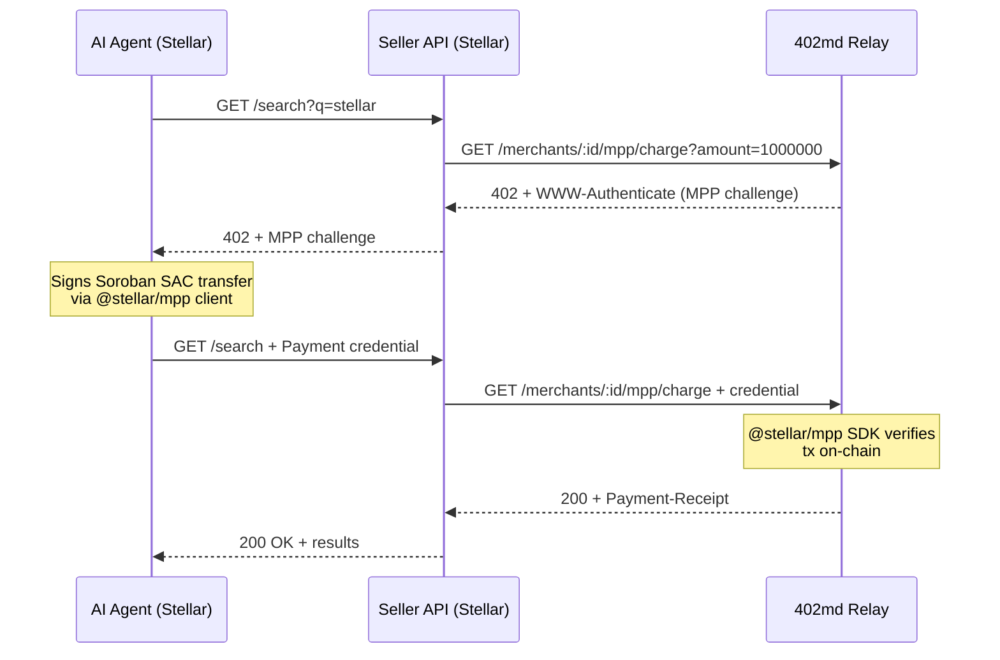

```mermaid
sequenceDiagram
    participant Agent as AI Agent (Base)
    participant Seller as Seller API (Base)
    participant Relay as 402md Relay
    participant Worker as 402md Worker
    participant Chain as Base

    Agent->>Seller: GET /weather
    Seller-->>Agent: 402 Payment Required

    Agent->>Seller: GET /weather + payment header
    Seller->>Relay: POST /verify
    Relay-->>Seller: { isValid: true } ~ms
    Seller-->>Agent: 200 OK + resource

    Seller->>Relay: POST /settle
    Relay->>Worker: startWorkflow(sameChainSettle)

    rect rgb(45, 50, 60)
        Note over Worker,Chain: Temporal Workflow — sameChainSettle
        Worker->>Chain: 1. pullFromBuyer — $1.00 USDC
        Note over Worker: 2. Deduct gas allowance
        Worker->>Chain: 3. Transfer net USDC to seller
        Worker->>Worker: 4. Record in ledger
    end
```

# 402md Facilitator

[](LICENSE)
[](https://x402.org)
[](https://www.machinepayments.com/)
[](https://www.circle.com/cross-chain-transfer-protocol)
[](https://base.org)
[](https://solana.com)
[](https://stellar.org)
[](https://www.typescriptlang.org)

**[402md](https://402md.com)** is a company specialized in payment infrastructure. The **Facilitator** is a cross-chain USDC settlement service for the x402 and MPP ecosystems.

## Why

A seller monetizing an API via x402 can only receive payments from buyers on chains they explicitly support. A seller on Stellar misses every buyer on Base or Solana. Adding chains means managing multiple wallets, multiple SDKs, and bridging logic.

The 402md Facilitator eliminates this. The seller registers once — one wallet, one chain — and gets a `merchantId` plus the facilitator's receiving addresses on every supported chain. Buyers pay on whatever chain they're on using standard `@x402/client`, zero changes. The Facilitator identifies the seller, bridges via [Circle CCTP V2](https://www.circle.com/cross-chain-transfer-protocol) (native USDC, no wrapped tokens, no slippage), and delivers USDC to the seller's wallet. Same-chain payments settle directly.

Dual-protocol: supports both [x402](https://x402.org) (Coinbase's HTTP 402 protocol) and [MPP](https://www.machinepayments.com/) (Machine Payments Protocol) via the [`@stellar/mpp`](https://github.com/stellar/stellar-mpp-sdk) SDK. Sellers on Stellar get micropayments through Charge Mode with zero custom libraries.

Includes a **bazaar** — a discovery endpoint where agents can find paywalled services — and an **on-ramp** endpoint listing fiat-to-USDC providers (Bridge.xyz, MoneyGram).

Free and open source. No platform fee, sellers only pay network gas. MIT licensed.

## How It Works

Without 402md, this payment fails:


With 402md:


### x402 Cross-Chain Settlement

Example: an AI agent on Base pays for a search API hosted by a seller on Stellar. The agent gets the resource in milliseconds. Settlement runs in background via Temporal.

When the destination is Stellar, the EVM adapter uses `depositForBurnWithHook` with `CctpForwarder` — the CCTP V2 contract that atomically mints and forwards USDC to the seller's Stellar address.

```mermaid
sequenceDiagram
    participant Agent as AI Agent (Base)
    participant Seller as Seller API (Stellar)
    participant Relay as 402md Relay
    participant Worker as 402md Worker
    participant Source as Base
    participant CCTP as Circle CCTP V2
    participant Dest as Stellar

    Agent->>Seller: GET /search?q=stellar
    Seller-->>Agent: 402 Payment Required (accepts: Base, Solana, Stellar)

    Note over Agent: Signs USDC authorization<br/>to facilitator address on Base

    Agent->>Seller: GET /search + payment header
    Seller->>Relay: POST /verify (paymentPayload + merchantId)
    Relay-->>Seller: { isValid: true } ~ms
    Seller-->>Agent: 200 OK + results

    Note over Agent: Agent has results.<br/>Settlement happens async

    Seller->>Relay: POST /settle (paymentPayload + merchantId)
    Relay->>Worker: startWorkflow(crossChainSettle)

    rect rgb(45, 50, 60)
        Note over Worker,Dest: Temporal Workflow — crossChainSettle
        Worker->>Source: 1. pullFromBuyer — $1.00 USDC
        Source-->>Worker: pull tx confirmed
        Note over Worker: 2. Retain gas allowance ($0.0005)
        Worker->>Source: 3. depositForBurnWithHook — $0.9995<br/>(mintRecipient = CctpForwarder,<br/>hookData = seller's Stellar address)
        Source-->>Worker: burn tx confirmed
        Worker->>CCTP: 4. waitAttestation (poll Circle Iris API)
        CCTP-->>Worker: attestation received
        Worker->>Dest: 5. receive_message on MessageTransmitter<br/>CctpForwarder mints + forwards to seller
        Dest-->>Worker: mint tx confirmed
        Worker->>Worker: 6. Record in ledger
    end
```



### x402 Same-Chain Settlement

Both parties on the same chain. No bridge needed.



### MPP Charge Mode (Stellar)

MPP uses push mode via the official `@stellar/mpp` SDK. The buyer signs a Soroban SAC `transfer` invocation. The facilitator verifies and settles on-chain.



### Settlement Times

| Origin     | Destination     | Time       |
| ---------- | --------------- | ---------- |
| Stellar    | Base, Solana    | ~5-10s     |
| Solana     | Base, Stellar   | ~25-30s    |
| Base (EVM) | Solana, Stellar | ~15-19 min |
| Same-chain | Same-chain      | < 5s       |

> Settlement time is dominated by source chain finality. Circle issues the CCTP attestation after hard finality; the destination mint is near-instant.

## Seller DX

No dashboard, no login, no SDK. One curl to start receiving cross-chain USDC:

**1. Register your wallet (one-time):**

```bash
curl -X POST https://api.402md.com/register \
  -H "Content-Type: application/json" \
  -d '{ "wallet": "GSELLER...", "network": "stellar:pubnet" }'
```

**Response:**

```json
{
  "merchantId": "hb-a1b2c3",
  "wallet": "GSELLER...",
  "network": "stellar:pubnet",
  "facilitatorAddresses": {
    "eip155:8453": "0xFacilitatorBase",
    "solana:mainnet": "FacilitatorSolAddr",
    "stellar:pubnet": "GFacilitatorStellarAddr"
  }
}
```

**2. Use the standard `@x402/express` SDK from Coinbase — zero 402md dependencies:**

```typescript
import { paymentMiddleware } from '@x402/express'

app.use(
  paymentMiddleware({
    'GET /search': {
      accepts: [
        {
          scheme: 'exact',
          network: 'eip155:8453',
          payTo: '0xFacilitatorBase',
          price: '$0.001',
          extra: { merchantId: 'hb-a1b2c3' },
        },
        {
          scheme: 'exact',
          network: 'stellar:pubnet',
          payTo: 'GFacilitatorStellarAddr',
          price: '$0.001',
          extra: { merchantId: 'hb-a1b2c3' },
        },
      ],
    },
  }),
)
```

**3. Need USDC? Check available on-ramp providers:**

```bash
curl https://api.402md.com/onramp?network=stellar:pubnet&walletAddress=GSELLER...
```

That's it. The seller's API now accepts USDC from any supported chain. Buyers on Base pay on Base; the seller receives on Stellar. No bridging logic, no multi-chain wallet management.

## API Endpoints

### Sellers

| Method | Endpoint                    | Description                                                      |
| ------ | --------------------------- | ---------------------------------------------------------------- |
| `POST` | `/register`                 | Register seller wallet, get `merchantId` + facilitator addresses |
| `GET`  | `/discover?merchantId=<id>` | Accepted networks + fees for a seller (cacheable)                |
| `GET`  | `/supported`                | List all supported networks                                      |
| `GET`  | `/.well-known/x402.json`    | x402 V2 service discovery metadata                               |

### Settlements (x402)

| Method | Endpoint                               | Description                             |
| ------ | -------------------------------------- | --------------------------------------- |
| `POST` | `/verify`                              | Verify buyer payment (~ms, synchronous) |
| `POST` | `/settle`                              | Dispatch settlement workflow (async)    |
| `GET`  | `/bridge/status/:workflowId`           | Real-time settlement status + tx hashes |
| `GET`  | `/bridge/fees?from=<caip2>&to=<caip2>` | Fee quote for a chain pair              |

### MPP (Stellar)

| Method     | Endpoint                            | Description                                    |
| ---------- | ----------------------------------- | ---------------------------------------------- |
| `GET`      | `/merchants/:merchantId/mpp/config` | MPP method spec (currency, recipient, network) |
| `GET/POST` | `/merchants/:merchantId/mpp/charge` | Charge Mode — handles 402 challenge + payment  |

### Discovery & On-Ramp

| Method | Endpoint  | Description                                         |
| ------ | --------- | --------------------------------------------------- |
| `GET`  | `/bazaar` | List registered sellers (filter by network, search) |
| `GET`  | `/onramp` | List fiat-to-USDC providers (Bridge.xyz, MoneyGram) |
| `GET`  | `/health` | Service health check (DB, Redis, Temporal)          |

## Supported Chains

| Chain          | Pull Mechanism                                   | CCTP Burn                                                 | SDK                    |
| -------------- | ------------------------------------------------ | --------------------------------------------------------- | ---------------------- |
| **Base (EVM)** | EIP-3009 `transferWithAuthorization`             | `depositForBurn` / `depositForBurnWithHook` (for Stellar) | `viem`                 |
| **Solana**     | Facilitator as fee payer + SPL `TransferChecked` | CCTP program `depositForBurn`                             | `@solana/web3.js`      |
| **Stellar**    | Facilitator as fee source + payment operation    | Soroban `deposit_for_burn` on TokenMessengerMinter        | `@stellar/stellar-sdk` |

When the destination is Stellar (CCTP domain 27), the EVM adapter uses `depositForBurnWithHook` with the `CctpForwarder` contract. This encodes the seller's Stellar address in `hookData` so the forwarder atomically mints and forwards USDC to the seller.

Adding a new CCTP-supported chain (e.g., Polygon, Arbitrum) requires only a new RPC config — zero contract deployments, zero audits.

## Fee Model

**No platform fee.** 402md Facilitator charges 0% commission. The only cost is a gas allowance — a fixed amount per route that covers the on-chain transactions the facilitator submits on behalf of the buyer and seller (pull, burn, mint, transfer). This allowance is deducted from the gross payment before delivering to the seller, so the facilitator is never out of pocket.

### How it works

In x402, the buyer signs an authorization but **does not pay gas** — the facilitator submits all transactions. The gas allowance reimburses the facilitator from the payment itself:

```
Buyer pays:     $1.000000 USDC
Gas allowance: -$0.000500 (fixed, covers pull + burn + mint)
Platform fee:  -$0.000000 (0%)
                ──────────
Seller receives: $0.999500 USDC
```

In MPP Charge Mode, the buyer broadcasts the transaction directly and pays gas themselves. No deduction from the seller.

### Gas allowance per route

| Route             | Gas Allowance | Seller receives (on $1.00) |
| ----------------- | ------------- | -------------------------- |
| Base → Stellar    | $0.000500     | $0.999500                  |
| Stellar → Base    | $0.000500     | $0.999500                  |
| Base → Solana     | $0.000800     | $0.999200                  |
| Solana → Base     | $0.001200     | $0.998800                  |
| Solana → Stellar  | $0.000800     | $0.999200                  |
| Stellar → Solana  | $0.000800     | $0.999200                  |
| Base → Base       | $0.000400     | $0.999600                  |
| Solana → Solana   | $0.000800     | $0.999200                  |
| Stellar → Stellar | $0.000006     | $0.999994                  |

These are fixed values, not estimates. If actual gas is lower than the allowance, the facilitator retains the difference. If higher, the facilitator absorbs it. CCTP itself charges no fee — burn/mint is 1:1.

### Summary

| Scenario           | Cost                                  | Who Pays                    |
| ------------------ | ------------------------------------- | --------------------------- |
| Same-chain (x402)  | Gas allowance (fixed schedule)        | Deducted from seller payout |
| Cross-chain (x402) | Gas allowance (fixed schedule)        | Deducted from seller payout |
| MPP Charge         | Gas (buyer broadcasts, pays directly) | Buyer                       |
| Platform fee       | None (0%)                             | —                           |

## Security

- **Non-custodial** — CCTP mints directly to seller via CctpForwarder. Facilitator never custodies seller funds
- **No custom smart contracts** — calls standard USDC (EIP-3009) + CCTP TokenMessenger/CctpForwarder via chain SDKs
- **Circuit breakers** — per-tx limit, daily volume limit, global pause (all off-chain via Redis)
- **Replay protection** — EIP-3009 nonce (EVM) + authorization nonce (Solana/Stellar) + Redis dedup
- **Gas wallet isolation** — facilitator hot wallet can only submit settlement transactions
- **Idempotent workflows** — deterministic Temporal workflow IDs prevent duplicate settlements

## Monorepo Structure

```
packages/
├── relay/         @402md/relay        — HTTP API (Elysia/Bun)
├── worker/        @402md/worker       — Settlement workflows (Temporal/Node.js)
├── shared/        @402md/shared       — Network adapters, DB schema, cache, tracing
├── demo-seller/   @402md/demo-seller  — Example: paywalled search API on Stellar
└── demo-agent/    @402md/demo-agent   — Example: agent that discovers + pays services
scripts/
└── demo.sh        End-to-end demo orchestrator
```

| Package       | Runtime | Framework             | Purpose                                                                |
| ------------- | ------- | --------------------- | ---------------------------------------------------------------------- |
| `relay`       | Bun     | Elysia.js             | HTTP API, seller registration, payment verification, Temporal dispatch |
| `worker`      | Node.js | Temporal SDK          | On-chain settlement: pull, CCTP burn/mint, ledger                      |
| `shared`      | —       | —                     | Network adapters (EVM, Solana, Stellar), Drizzle schema, Redis, OTEL   |
| `demo-seller` | Bun     | Elysia + @stellar/mpp | MPP-paywalled search API on Stellar testnet                            |
| `demo-agent`  | Bun     | @stellar/mpp          | Agent that discovers sellers via bazaar and pays via MPP               |

> Worker uses Node.js because the Temporal SDK requires native modules incompatible with Bun.

## Getting Started

### Prerequisites

- [Bun](https://bun.sh/) (latest)
- [Node.js](https://nodejs.org/) 20+
- [Docker](https://www.docker.com/) (for local infrastructure)

### Setup

Start local infrastructure (PostgreSQL, Redis, Temporal):

```bash
docker compose up -d
```

Install dependencies and build all packages:

```bash
bun install
bun run build
```

Push the database schema:

```bash
cd packages/relay
bun run db:push
```

Run the relay:

```bash
cd packages/relay
bun run dev
```

Run the worker (separate terminal):

```bash
cd packages/worker
bun run dev
```

The relay starts at `http://localhost:3000`. Temporal UI is available at `http://localhost:8233`.

### Demo

Run the full end-to-end demo (starts relay, worker, demo-seller, and demo-agent):

```bash
./scripts/demo.sh
```

The demo-seller auto-registers with the facilitator, creates a paywalled search API, and the demo-agent discovers it via `/bazaar`, makes paid queries via MPP Charge Mode, and prints results.

### Environment Variables

Each package requires a `.env` file. See `.env.example` in each package directory for required variables.

Key variables:

| Variable                          | Description                                      |
| --------------------------------- | ------------------------------------------------ |
| `NETWORK_ENV`                     | `testnet` or `mainnet` (default: `testnet`)      |
| `FACILITATOR_STELLAR`             | Your Stellar public key (receiving address)      |
| `FACILITATOR_PRIVATE_KEY_STELLAR` | Your Stellar secret key (worker only, signs txs) |
| `FACILITATOR_BASE`                | Your Base address (receiving address)            |
| `FACILITATOR_PRIVATE_KEY_BASE`    | Your Base private key (worker only, signs txs)   |
| `MPP_SECRET_KEY`                  | HMAC secret for MPP challenge binding            |

## Scripts

| Command              | Description                    |
| -------------------- | ------------------------------ |
| `bun run build`      | Build all packages (Turborepo) |
| `bun run test`       | Run all tests                  |
| `bun run lint`       | Lint all packages              |
| `bun run format`     | Check formatting (Prettier)    |
| `bun run format:fix` | Fix formatting                 |
| `./scripts/demo.sh`  | Run end-to-end demo            |

### Relay-specific

| Command               | Description                 |
| --------------------- | --------------------------- |
| `bun run db:generate` | Generate Drizzle migrations |
| `bun run db:push`     | Push schema to database     |
| `bun run db:migrate`  | Run migrations              |

## Infrastructure

| Service       | Port | Purpose                                                     |
| ------------- | ---- | ----------------------------------------------------------- |
| PostgreSQL 15 | 5432 | Application database (shared schema, relay owns migrations) |
| Redis 7       | 6379 | Replay protection, circuit breakers, daily volume tracking  |
| Temporal      | 7233 | Durable workflow orchestration (self-hosted OSS)            |
| Temporal UI   | 8233 | Workflow visibility dashboard                               |

### Performance Targets

| Metric                 | Target                              |
| ---------------------- | ----------------------------------- |
| Verify latency         | < 50ms p95                          |
| Same-chain settlement  | < 5s                                |
| Cross-chain settlement | ~5s-19min (depends on source chain) |
| Concurrent settlements | 100+ simultaneous workflows         |
| Workflows/month        | Up to 100K (single PG node)         |
| Relay uptime           | 99.9%                               |

## Contributing

Contributions are welcome! This is an open source project and we appreciate help from the community.

1. Fork the repository
2. Create your feature branch (`git checkout -b feat/my-feature`)
3. Commit your changes (`git commit -m 'feat: add my feature'`)
4. Push to the branch (`git push origin feat/my-feature`)
5. Open a Pull Request

See [`.claude/rules/code-standards.md`](./.claude/rules/code-standards.md) for coding conventions and [`.claude/rules/git-workflow.md`](./.claude/rules/git-workflow.md) for commit message format.

## Key Documents

- [`402md-bridge-technical-spec.md`](./402md-bridge-technical-spec.md) — Full technical specification (~2,600 lines)
- [`docs/plans/`](./docs/plans/) — Implementation plans
- [`.claude/rules/`](./.claude/rules/) — Architecture decisions, code standards, security model

## License

402md Facilitator is licensed under the MIT license. See the [`LICENSE`](LICENSE) file for more information.
