# 402md Facilitator

[](LICENSE)
[](https://x402.org)
[](https://www.machinepayments.com/)
[](https://www.circle.com/cross-chain-transfer-protocol)
[](https://base.org)
[](https://solana.com)
[](https://stellar.org)
[](https://www.typescriptlang.org)

## Why

402md Facilitator lets a seller receive USDC on their chain from buyers on any chain. One wallet, one registration. The seller calls `POST /register` with the wallet address and network where they want to receive, and gets back a `merchantId` plus the facilitator's receiving addresses on every supported chain. In the x402 middleware config, the seller points the facilitator URL to 402md, lists those addresses in `accepts[]` for each network, and passes the `merchantId` in the extra field. That's it. Buyers pay to the facilitator address on their chain with no changes to their workflow or SDK, 402md identifies the seller by `merchantId`, and delivers USDC to the seller's registered wallet. Cross-chain payments are bridged through [Circle CCTP V2](https://www.circle.com/cross-chain-transfer-protocol) (native USDC, no wrapped tokens). Same-chain payments settle directly. Also works as an [MPP](https://www.machinepayments.com/) payment method, including Stellar's native MPP and x402 under MPP.

Free and open source. No platform fee, sellers only pay network gas. Use the hosted instance at [facilitator.402.md](https://facilitator.402.md) or self-host your own. MIT licensed.

## How It Works

Without 402md, this payment fails:


With 402md:


### x402 Cross-Chain Settlement

Example: an AI agent on Stellar pays for a weather API hosted by a seller on Base. The agent gets the resource in milliseconds. Settlement (pull, CCTP burn, attestation, mint to seller) runs in background via Temporal.

```mermaid
sequenceDiagram
    participant Agent as AI Agent (Stellar)
    participant Seller as Seller API (Base)
    participant Relay as 402md Relay
    participant Worker as 402md Worker
    participant Source as Source Chain (Stellar)
    participant CCTP as Circle CCTP V2
    participant Dest as Dest Chain (Base)

    Agent->>Seller: GET /weather
    Seller-->>Agent: 402 Payment Required (accepts: Stellar, Base, Solana)

    Note over Agent: Signs USDC authorization<br/>to facilitator address on Stellar

    Agent->>Seller: GET /weather + payment header
    Seller->>Relay: POST /verify (paymentPayload + merchantId)
    Relay-->>Seller: { isValid: true } ~ms
    Seller-->>Agent: 200 OK + resource

    Note over Agent: Agent has resource.<br/>Settlement happens async ↓

    Seller->>Relay: POST /settle (paymentPayload + merchantId)
    Relay->>Worker: startWorkflow(crossChainSettle)

    rect rgb(45, 50, 60)
        Note over Worker,Dest: Temporal Workflow — crossChainSettle
        Worker->>Source: 1. pullFromBuyer — $1.00 USDC
        Source-->>Worker: ✓ pull tx confirmed
        Note over Worker: 2. Retain gas allowance ($0.0004)
        Worker->>Source: 3. CCTP burn — $0.9996 (mintRecipient = seller)
        Source-->>Worker: ✓ burn tx confirmed
        Worker->>CCTP: 4. waitAttestation (poll Circle API)
        Note over CCTP: Stellar finality ~5-10s
        CCTP-->>Worker: ✓ attestation received
        Worker->>Dest: 5. CCTP mint — $0.9996 to seller on Base
        Dest-->>Worker: ✓ mint tx confirmed
        Worker->>Worker: 6. Record in ledger
    end
```



### x402 Same-Chain Settlement

Both parties on Base. No bridge needed. The worker pulls USDC from the buyer, deducts gas allowance, and transfers the net amount to the seller.

```mermaid
sequenceDiagram
    participant Agent as AI Agent (Base)
    participant Seller as Seller API (Base)
    participant Relay as 402md Relay
    participant Worker as 402md Worker
    participant Chain as Base

    Agent->>Seller: GET /weather
    Seller-->>Agent: 402 Payment Required

    Agent->>Seller: GET /weather + payment header
    Seller->>Relay: POST /verify
    Relay-->>Seller: { isValid: true } ~ms
    Seller-->>Agent: 200 OK + resource

    Seller->>Relay: POST /settle
    Relay->>Worker: startWorkflow(sameChainSettle)

    rect rgb(45, 50, 60)
        Note over Worker,Chain: Temporal Workflow — sameChainSettle
        Worker->>Chain: 1. pullFromBuyer — $1.00 USDC
        Note over Worker: 2. Deduct gas allowance
        Worker->>Chain: 3. Transfer net USDC to seller
        Worker->>Worker: 4. Record in ledger
    end
```



### MPP Cross-Chain Settlement

```mermaid
sequenceDiagram
    participant Agent as AI Agent
    participant Service as MPP Service
    participant Relay as 402md Relay
    participant Worker as 402md Worker
    participant Source as Source Chain
    participant CCTP as Circle CCTP V2
    participant Dest as Seller's Chain

    Agent->>Service: Request resource
    Service-->>Agent: 402 + MPP payment methods (incl. 402md)

    Agent->>Source: Broadcast USDC tx to facilitator address
    Note over Agent: MPP = push mode<br/>buyer pays gas directly

    Agent->>Relay: POST /mpp/settle (txHash + merchantId)

    rect rgb(45, 50, 60)
        Note over Worker,Dest: Temporal Workflow — crossChainSettle
        Relay->>Worker: startWorkflow()
        Worker->>Source: Verify incoming tx
        Worker->>Source: CCTP burn (net amount)
        Worker->>CCTP: waitAttestation
        CCTP-->>Worker: ✓ attestation
        Worker->>Dest: CCTP mint to seller
        Worker->>Worker: Record in ledger
    end

    Relay-->>Service: { settled: true }
    Service-->>Agent: 200 OK + resource
```

MPP uses push mode: the buyer broadcasts the USDC transaction directly and pays gas. The relay verifies the tx on-chain and starts the same CCTP bridge workflow.



### Settlement Times

| Origin     | Destination     | Time       |
| ---------- | --------------- | ---------- |
| Stellar    | Base, Solana    | ~5-10s     |
| Solana     | Base, Stellar   | ~25-30s    |
| Base (EVM) | Solana, Stellar | ~15-19 min |
| EVM        | EVM             | ~15-19 min |

> Settlement time is dominated by source chain finality. Circle issues the CCTP attestation after hard finality; the destination mint is near-instant.

## Seller DX

No dashboard, no login, no SDK. One curl to start receiving cross-chain USDC:

**1. Register your wallet (one-time):**

```bash
curl -X POST https://api.402md.com/register \
  -H "Content-Type: application/json" \
  -d '{ "wallet": "0xABC123...", "network": "eip155:8453" }'
```

**Response:**

```json
{
  "merchantId": "hb-a1b2c3",
  "wallet": "0xABC123...",
  "network": "eip155:8453",
  "facilitatorAddresses": {
    "eip155:8453": "0xFacilitatorBase",
    "solana:mainnet": "FacilitatorSolAddr",
    "stellar:pubnet": "FacilitatorStellarAddr"
  }
}
```

**2. Use the standard `@x402/express` SDK from Coinbase — zero 402md dependencies:**

```typescript
import { paymentMiddleware } from '@x402/express'

app.use(
  paymentMiddleware({
    'GET /weather': {
      accepts: [
        {
          scheme: 'exact',
          network: 'eip155:8453',
          payTo: '0xFacilitatorBase',
          price: '$0.001',
          extra: { merchantId: 'hb-a1b2c3' },
        },
        {
          scheme: 'exact',
          network: 'solana:mainnet',
          payTo: 'FacilitatorSolAddr',
          price: '$0.001',
          extra: { merchantId: 'hb-a1b2c3' },
        },
      ],
    },
  }),
)
```

That's it. The seller's API now accepts USDC from any supported chain. Buyers on Solana pay on Solana; the seller receives on Base. No bridging logic, no multi-chain wallet management.

## API Endpoints

### x402

| Method | Endpoint                               | Description                                                      |
| ------ | -------------------------------------- | ---------------------------------------------------------------- |
| `POST` | `/register`                            | Register seller wallet, get `merchantId` + facilitator addresses |
| `GET`  | `/discover?merchantId=<id>`            | Accepted networks + fees for a seller (cacheable, 1hr TTL)       |
| `POST` | `/verify`                              | Verify buyer payment (~ms, synchronous)                          |
| `POST` | `/settle`                              | Dispatch settlement workflow (async)                             |
| `GET`  | `/bridge/status/:workflowId`           | Real-time settlement status + tx hashes                          |
| `GET`  | `/bridge/fees?from=<caip2>&to=<caip2>` | Fee quote for a chain pair                                       |
| `GET`  | `/.well-known/x402.json`               | x402 V2 service discovery metadata                               |

### MPP

| Method | Endpoint                            | Description                               |
| ------ | ----------------------------------- | ----------------------------------------- |
| `GET`  | `/merchants/:merchantId/mpp/config` | Payment method config for MPP integration |
| `POST` | `/merchants/:merchantId/mpp/verify` | Verify MPP payment on-chain               |
| `POST` | `/merchants/:merchantId/mpp/settle` | Start settlement workflow                 |

## Supported Chains

| Chain          | Pull Mechanism                                   | CCTP Burn                             | SDK                    |
| -------------- | ------------------------------------------------ | ------------------------------------- | ---------------------- |
| **Base (EVM)** | EIP-3009 `transferWithAuthorization`             | `depositForBurn` on TokenMessenger    | `viem`                 |
| **Solana**     | Facilitator as fee payer + SPL `TransferChecked` | CCTP program `depositForBurn`         | `@solana/web3.js`      |
| **Stellar**    | Facilitator as fee source + payment operation    | `depositForBurn` via Stellar contract | `@stellar/stellar-sdk` |

Adding a new CCTP-supported chain (e.g., Polygon, Arbitrum) requires only a new RPC config — zero contract deployments, zero audits.

## Fee Model

**Free forever** — no platform fee, no commission. Sellers only pay actual network costs (gas + CCTP).

| Scenario           | Cost                                   | Who Pays                    |
| ------------------ | -------------------------------------- | --------------------------- |
| Same-chain (x402)  | Gas allowance (fixed schedule)         | Deducted from seller payout |
| Cross-chain (x402) | Gas + CCTP allowance (fixed schedule)  | Deducted from seller payout |
| MPP (any)          | Gas (buyer pays directly in push mode) | Buyer                       |
| Platform fee       | None (0%)                              | —                           |

> Network costs are negligible: Stellar ~$0.000003, Solana ~$0.0004, Base ~$0.0002

## Security

- **Non-custodial** — CCTP mints directly to seller. Facilitator never custodies seller funds
- **No custom smart contracts** — calls standard USDC (EIP-3009) + CCTP TokenMessenger via chain SDKs
- **Circuit breakers** — per-tx limit, daily volume limit, global pause (all off-chain via Redis)
- **Replay protection** — EIP-3009 nonce (EVM) + authorization nonce (Solana/Stellar) + Redis dedup
- **Gas wallet isolation** — facilitator hot wallet can only submit settlement transactions
- **Idempotent workflows** — deterministic Temporal workflow IDs prevent duplicate settlements

## Monorepo Structure

```
packages/
├── relay/     @402md/relay   — HTTP API (Elysia/Bun)
├── worker/    @402md/worker  — Settlement workflows (Temporal/Node.js)
└── mpp/       @402md/mpp     — MPP payment method plugin
test/
└── e2e/       End-to-end tests
docs/
└── plans/     Implementation plans
```

| Package  | Runtime | Framework    | Purpose                                                                |
| -------- | ------- | ------------ | ---------------------------------------------------------------------- |
| `relay`  | Bun     | Elysia.js    | HTTP API, seller registration, payment verification, Temporal dispatch |
| `worker` | Node.js | Temporal SDK | On-chain settlement: pull, CCTP burn/mint, ledger                      |
| `mpp`    | Node.js | —            | MPP payment method spec for cross-chain USDC                           |

> Worker uses Node.js because the Temporal SDK requires native modules incompatible with Bun.

## Getting Started

### Prerequisites

- [Bun](https://bun.sh/) (latest)
- [Node.js](https://nodejs.org/) 20+
- [Docker](https://www.docker.com/) (for local infrastructure)

### Setup

Start local infrastructure (PostgreSQL, Redis, Temporal):

```bash
docker compose up -d
```

Install dependencies and build all packages:

```bash
bun install
bun run build
```

Push the database schema:

```bash
cd packages/relay
bun run db:push
```

Run the relay:

```bash
cd packages/relay
bun run dev
```

Run the worker (separate terminal):

```bash
cd packages/worker
bun run dev
```

The relay starts at `http://localhost:3000`. Temporal UI is available at `http://localhost:8233`.

### Environment Variables

Each package requires a `.env` file. See `.env.example` in each package directory for required variables.

## Scripts

| Command              | Description                    |
| -------------------- | ------------------------------ |
| `bun run build`      | Build all packages (Turborepo) |
| `bun run test`       | Run all tests                  |
| `bun run lint`       | Lint all packages              |
| `bun run format`     | Check formatting (Prettier)    |
| `bun run format:fix` | Fix formatting                 |

### Relay-specific

| Command               | Description                 |
| --------------------- | --------------------------- |
| `bun run db:generate` | Generate Drizzle migrations |
| `bun run db:push`     | Push schema to database     |
| `bun run db:migrate`  | Run migrations              |

## Infrastructure

| Service       | Port | Purpose                                                     |
| ------------- | ---- | ----------------------------------------------------------- |
| PostgreSQL 15 | 5432 | Application database (shared schema, relay owns migrations) |
| Redis 7       | 6379 | Replay protection, circuit breakers, daily volume tracking  |
| Temporal      | 7233 | Durable workflow orchestration (self-hosted OSS)            |
| Temporal UI   | 8233 | Workflow visibility dashboard                               |

### Performance Targets

| Metric                 | Target                              |
| ---------------------- | ----------------------------------- |
| Verify latency         | < 50ms p95                          |
| Same-chain settlement  | < 5s                                |
| Cross-chain settlement | ~5s-19min (depends on source chain) |
| Concurrent settlements | 100+ simultaneous workflows         |
| Workflows/month        | Up to 100K (single PG node)         |
| Relay uptime           | 99.9%                               |

## Contributing

Contributions are welcome! This is an open source project and we appreciate help from the community.

1. Fork the repository
2. Create your feature branch (`git checkout -b feat/my-feature`)
3. Commit your changes (`git commit -m 'feat: add my feature'`)
4. Push to the branch (`git push origin feat/my-feature`)
5. Open a Pull Request

See [`.claude/rules/code-standards.md`](./.claude/rules/code-standards.md) for coding conventions and [`.claude/rules/git-workflow.md`](./.claude/rules/git-workflow.md) for commit message format.

## Key Documents

- [`402md-bridge-technical-spec.md`](./402md-bridge-technical-spec.md) — Full technical specification (~2,600 lines)
- [`docs/plans/`](./docs/plans/) — Implementation plans
- [`.claude/rules/`](./.claude/rules/) — Architecture decisions, code standards, security model

## License

402md Facilitator is licensed under the MIT license. See the [`LICENSE`](LICENSE) file for more information.
