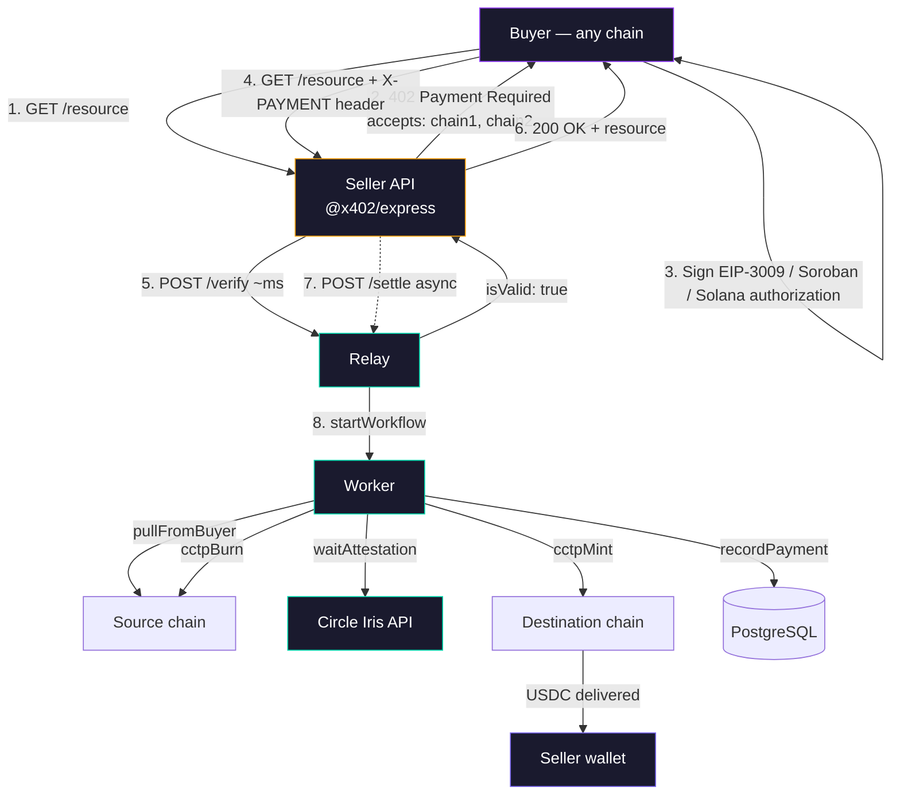

# Architecture overview

The Facilitator has two long-running processes and three backing services. Every architectural choice here trades away generality for three properties: **cross-chain by default, durable under failure, low per-transaction cost**.

## The two processes

### Relay (`packages/relay`, Bun + Elysia)

Stateless HTTP API. Accepts `POST /verify` and `POST /settle` from x402 sellers, returns cached discovery info, and dispatches Temporal workflows. It talks to PostgreSQL (to persist sellers and ledger entries), Redis (for replay protection and circuit breakers), and Temporal (to start workflows). It never signs a blockchain transaction.

This is where HTTP hotpaths live. Verify latency has a target of < 50 ms p95, because it sits inline with the buyer's request.

### Worker (`packages/worker`, Node.js + Temporal SDK)

Stateful only in the sense that it holds keys. It polls two Temporal task queues (`fast-settlement`, `cross-settlement`) and executes activities: pull USDC from buyer, burn on CCTP, wait for attestation, mint on destination, record to ledger. Every chain interaction lives in this process.

The worker runs on Node.js (not Bun) because the Temporal TypeScript SDK uses native modules that Bun's runtime does not yet support. This is the only reason for the split runtime.

## The three backing services

### PostgreSQL

Single database shared by relay and worker. Schemas:

- `sellers` — merchant IDs, wallet addresses, registered network.
- `bazaarResources` — the public catalog of paywalled resources, refreshed as payments flow.
- `transactions` — ledger of every settled payment.

The relay owns migrations. The worker imports schema types from `@402md/shared` but does not generate migrations. This keeps one source of truth.

Temporal itself also uses PostgreSQL (for its own persistence), but in a separate schema. Same database instance, logically separated.

### Redis

- Replay protection: `SETNX` on an EIP-3009 nonce / authorization nonce / transaction hash before settling.
- Daily volume circuit breaker: `INCRBY` against a daily-keyed counter with 24-hour TTL.
- Pause flag: single key `facilitator:pause`.
- Rate limits: per-IP counters per endpoint.

No business data lives in Redis. If Redis disappears, the relay degrades (replay protection falls back to the DB-unique ledger), but settlements already in flight complete.

### Temporal

Durable workflow engine. Two workflow types:

- `sameChainSettle` — buyer and seller on the same chain. Pull, transfer, record.
- `crossChainSettle` — different chains. Pull, CCTP burn, wait for Circle's attestation, mint on destination, record.

Every on-chain call is a Temporal activity with its own retry policy. See [Temporal workflows](./temporal-workflows.md) for why this matters.

## The full request flow

Steps 1–6 are synchronous from the buyer's perspective; 7–end run in background.

## x402 cross-chain settlement

Example: an AI agent on Base pays for a search API hosted by a seller on Stellar. The agent gets the resource in milliseconds. Settlement runs in background via Temporal.

When the destination is Stellar, the EVM adapter uses `depositForBurnWithHook` with `CctpForwarder` — the CCTP V2 contract that atomically mints and forwards USDC to the seller's Stellar address.

```mermaid
sequenceDiagram
    participant Agent as AI Agent (Base)
    participant Seller as Seller API (Stellar)
    participant Relay as Relay
    participant Worker as Worker
    participant Source as Base
    participant CCTP as Circle CCTP V2
    participant Dest as Stellar

    Agent->>Seller: GET /search?q=stellar
    Seller-->>Agent: 402 Payment Required (accepts: Base, Solana, Stellar)

    Note over Agent: Signs USDC authorization<br/>to Facilitator address on Base

    Agent->>Seller: GET /search + payment header
    Seller->>Relay: POST /verify (paymentPayload + merchantId)
    Relay-->>Seller: { isValid: true } ~ms
    Seller-->>Agent: 200 OK + results

    Note over Agent: Agent has results.<br/>Settlement happens async

    Seller->>Relay: POST /settle (paymentPayload + merchantId)
    Relay->>Worker: startWorkflow(crossChainSettle)

    rect rgb(45, 50, 60)
        Note over Worker,Dest: Temporal Workflow — crossChainSettle
        Worker->>Source: 1. pullFromBuyer — $1.00 USDC
        Source-->>Worker: pull tx confirmed
        Note over Worker: 2. Retain gas allowance ($0.0005)
        Worker->>Source: 3. depositForBurnWithHook — $0.9995<br/>(mintRecipient = CctpForwarder,<br/>hookData = seller's Stellar address)
        Source-->>Worker: burn tx confirmed
        Worker->>CCTP: 4. waitAttestation (poll Circle Iris API)
        CCTP-->>Worker: attestation received
        Worker->>Dest: 5. receive_message on MessageTransmitter<br/>CctpForwarder mints + forwards to seller
        Dest-->>Worker: mint tx confirmed
        Worker->>Worker: 6. Record in ledger
    end
```

## x402 same-chain settlement

Both parties on the same chain. No bridge needed.

```mermaid
sequenceDiagram
    participant Agent as AI Agent (Base)
    participant Seller as Seller API (Base)
    participant Relay as Relay
    participant Worker as Worker
    participant Chain as Base

    Agent->>Seller: GET /weather
    Seller-->>Agent: 402 Payment Required

    Agent->>Seller: GET /weather + payment header
    Seller->>Relay: POST /verify
    Relay-->>Seller: { isValid: true } ~ms
    Seller-->>Agent: 200 OK + resource

    Seller->>Relay: POST /settle
    Relay->>Worker: startWorkflow(sameChainSettle)

    rect rgb(45, 50, 60)
        Note over Worker,Chain: Temporal Workflow — sameChainSettle
        Worker->>Chain: 1. pullFromBuyer — $1.00 USDC
        Note over Worker: 2. Deduct gas allowance
        Worker->>Chain: 3. Transfer net USDC to seller
        Worker->>Worker: 4. Record in ledger
    end
```

## Why relay + worker are separate

- **Blast radius.** The relay is internet-facing. The worker holds private keys. Splitting the processes means a relay compromise never exposes signing material.
- **Scaling shape.** HTTP request rate and settlement throughput do not scale together. A relay pod handles thousands of verifies per second. A worker pod handles settlements bound by chain finality (minutes). Scale independently.
- **Runtime split.** Bun for the relay (faster HTTP, faster startup), Node for the worker (Temporal SDK compatibility).

## Why Temporal

Blockchain settlements span several transactions across multiple chains and can fail at any step. Temporal gives us:

- **Durable state.** If the worker crashes mid-flow, it resumes exactly where it left off. A burned-but-not-minted workflow never disappears.
- **Retry policies per activity.** Attestation polling can retry for 30 minutes; on-chain transactions retry 10 times with exponential backoff. These are declared, not coded imperatively.
- **Search attributes.** Every workflow is indexed by `sellerNetwork`, `buyerNetwork`, `settlementStatus`, `protocol` — queryable from the UI or CLI.
- **Idempotent dispatch.** Workflow IDs are deterministic (derived from the payment signature hash). Duplicate `POST /settle` calls become no-ops.

## No custom smart contracts

Every on-chain call is against a standard contract:

- USDC's `transferWithAuthorization` (EIP-3009) or equivalent on Solana/Stellar.
- Circle's `TokenMessengerV2.depositForBurn` and `MessageTransmitter.receiveMessage`.
- Circle's `CctpForwarder` when the destination is Stellar (lets EVM burns atomically forward to a Stellar address).

This eliminates audit surface, removes per-chain deployment, and means adding a new EVM CCTP V2 chain is config-only.

See [why CCTP V2](./why-cctp-v2.md).

## No dashboard, no SDK

The seller-side developer experience is `curl POST /register` and a paste-in `@x402/express` config. There is no login, no admin UI, no 402md SDK. Sellers use Coinbase's standard x402 middleware; the Facilitator is invisible to their codebase.

The intent is to keep the Facilitator as close as possible to "a URL you post to" — minimal integration surface, maximum chain coverage.

## What is not here

- **No seller custody.** The Facilitator never holds seller funds beyond the gas allowance. See [non-custodial model](./non-custodial-model.md).
- **No per-transaction fee discovery.** Gas allowances are fixed per route. See [fees](../reference/fees.md).
- **No Temporal-less path.** Every settlement — even same-chain — goes through a workflow. The durability floor is the same for a $0.001 payment and a $10,000 payment.

## Next

- [Why CCTP V2](./why-cctp-v2.md)
- [Non-custodial model](./non-custodial-model.md)
- [Temporal workflows](./temporal-workflows.md)
- [Security model](./security-model.md)
