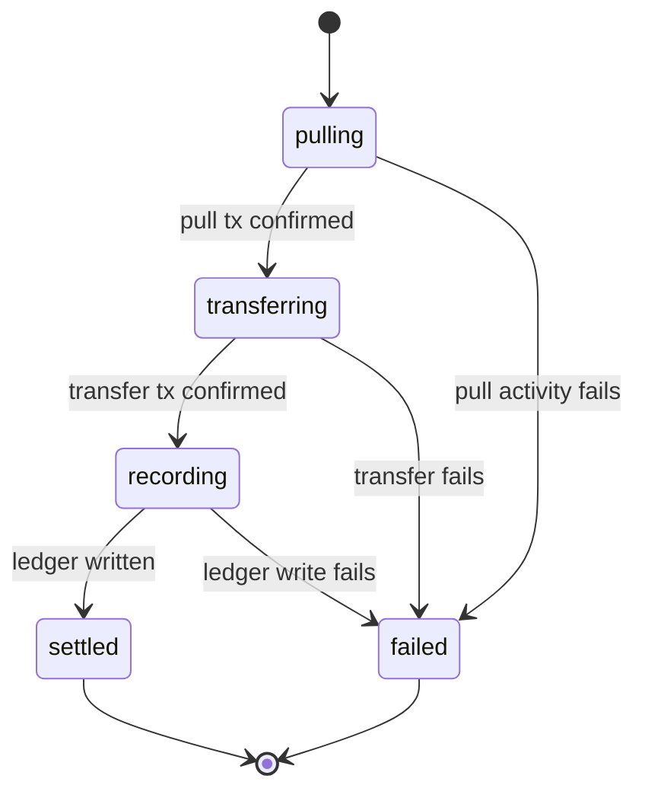
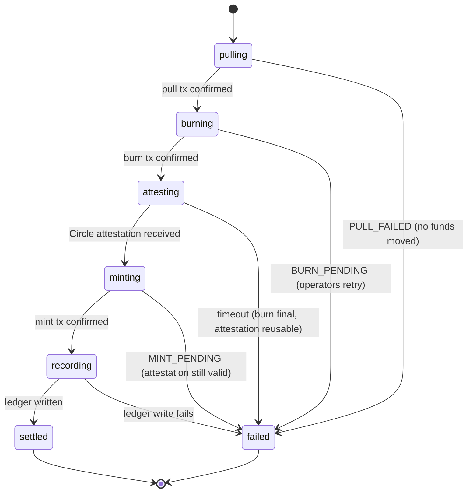

# Temporal workflows and durability

Every x402 settlement goes through a Temporal workflow. This document explains what that buys us and what it costs.

## The problem without Temporal

A cross-chain settlement is a chain of steps:

```
pull → burn → wait for attestation → mint → record
```

Each step can fail. Attestation can take 20 minutes. The worker can crash between `burn` and `mint`. Network partitions can duplicate requests. A naive implementation has to answer, for every pair of steps:

- "Did we already do this?"
- "If we crash now, what's the safe next action?"
- "If the next step fails, what compensation do we run?"

The state graph explodes. You either write a custom state machine with persistence and retries (months of work, many bugs), or use a workflow engine that solves it generically.

## What Temporal gives us

### Durable execution

A Temporal workflow is a program whose stack is persisted. If the worker crashes halfway through `crossChainSettle`, the next worker resumes the workflow at the exact event where it crashed — with the same local variables, the same pending activity, the same retry counter. This is load-bearing: "the burn succeeded but we haven't minted yet" is always recoverable.

### Retry policies per activity

We declare retry policies per activity based on its shape:

| Activity                                                    | Timeout | Max attempts | Backoff           |
| ----------------------------------------------------------- | ------- | ------------ | ----------------- |
| `pullFromBuyer`, `transferToSeller`, `cctpBurn`, `cctpMint` | 2 min   | 10           | 1 s → 30 s, ×2    |
| `waitAttestation`                                           | 30 min  | 20           | 5 s → 60 s, ×1.5  |
| `recordPayment`                                             | 30 s    | 5            | 500 ms → 10 s, ×2 |

On-chain activities have short attempt windows but many attempts — if a tx doesn't land in 2 minutes, the RPC or gas estimate is probably stale. Attestation polling uses a longer window because Circle's Iris API is typically healthy but can have short hiccups. These numbers live in the worker code, auditable in one place.

### Idempotent dispatch

Workflow IDs are deterministic: derived from the payment signature. A duplicate `POST /settle` with the same payload finds an existing workflow and returns its ID — it does not start a second settlement.

This is the cleanest way to handle client-side retries. The client does not need to implement dedup; Temporal handles it.

### Query and signal

The `status` query on each workflow returns the current step and tx hashes without waiting for termination. This powers `GET /bridge/status/:workflowId`. Sellers can poll in real time.

### Search attributes for observability

Every workflow is indexed by:

- `sellerNetwork`, `buyerNetwork` — CAIP-2 strings.
- `settlementStatus` — current step.
- `protocol` — `x402` or `mpp`.

These are first-class in Temporal's UI and CLI. "Show me all stuck attestations on Solana → Stellar in the last hour" is one query, not a log search.

## The two workflow types

### `sameChainSettle`

Buyer and seller on the same chain.



Three activities: `pullFromBuyer`, `transferToSeller`, `recordPayment`. Terminal in seconds.

### `crossChainSettle`



Five activities: `pullFromBuyer`, `cctpBurn`, `waitAttestation`, `cctpMint`, `recordPayment`. Terminal in seconds to ~20 min depending on source chain.

## Compensation — what happens when a step fails

The code does not have `if error then rollback`. Instead:

- **`pullFromBuyer` fails:** no funds moved. Workflow ends `failed`. Buyer can retry with a new authorization.
- **`cctpBurn` fails after `pullFromBuyer`:** USDC sits in the facilitator wallet. Workflow ends `failed` with `BURN_PENDING`. Operators investigate (usually a gas or RPC issue) and either retry the burn (common) or refund the buyer off-chain.
- **`waitAttestation` times out:** burn is on-chain and final, attestation is valid indefinitely once Circle issues it. Operators retry the workflow manually, which resumes at `waitAttestation`.
- **`cctpMint` fails:** attestation is still valid. Operators retry. The buyer-side pull is final, so no buyer-side rollback is required.

The property that makes this tractable is: **every chain call is idempotent given the same input**, because of nonces, workflow IDs, and attestation reuse. We never have to undo a successful step.

## Cost: what Temporal makes harder

### Workflow code is not normal code

Temporal enforces determinism. Calling `Math.random()`, `Date.now()`, or non-deterministic side-effects inside a workflow body breaks replay. Developers must route those through activities. This is a learning curve for contributors new to Temporal.

### Deployments must be migration-aware

Changing a workflow definition requires versioning if in-flight workflows will outlive the deploy. This matters for EVM cross-chain settlements (up to 20 min) but rarely for same-chain (seconds). Use Temporal's `patched()` API when changing workflow code.

### One more service to operate

Temporal is one more moving part: PostgreSQL schema, server, UI, CLI. Docker Compose makes this trivial locally; in production, it is a real service to deploy or pay Temporal Cloud for. Operators should decide early between self-hosted and Cloud.

## Why not a queue + idempotency key?

We considered it. BullMQ / SQS + explicit state transitions in PostgreSQL would work for same-chain settlements. For cross-chain, the 20-minute attestation wait with retries, the multi-step compensation, and the observability requirements make custom state-machine code expensive to maintain. Temporal eats those requirements end-to-end.

## Next

- [Architecture overview](./architecture.md) — where workflows fit.
- [Monitor workflows in Temporal](../how-to/operations/monitor-workflows-in-temporal.md) — practical operator guide.
- [Error handling rules](../../.claude/rules/error-handling.md) — canonical retry policy per activity.
