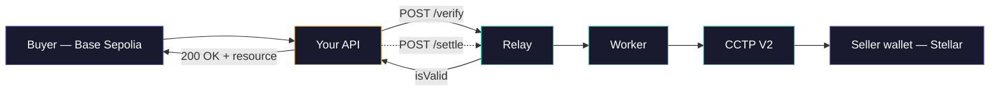

# Build a paywalled API with x402

In this tutorial you will turn a plain Express endpoint into a paywalled resource that accepts USDC payments from buyers on multiple chains, and receives settlement on your single wallet.

You will use the standard `@x402/express` SDK from Coinbase — no 402md-specific libraries. The 402md Facilitator verifies payments, bridges via CCTP V2, and delivers USDC to your wallet.

By the end, you will have an API that responds with `402 Payment Required`, negotiates payment over HTTP, and returns the resource on success.

> If you have not completed [Your first cross-chain payment](./01-first-cross-chain-payment.md) yet, do that first. It assumes you have a running relay, worker, and registered merchant.

## What you will build



A single Express app with one paywalled route. Payments from Base, Ethereum, and Stellar all land in your Stellar wallet.

## Prerequisites

- A running relay on `http://localhost:3000` (or a deployed one).
- A registered seller: you have a `merchantId` and the map of `facilitatorAddresses`.
- Node.js 20+ and `npm` or `bun`.

## 1. Scaffold an Express app

```bash
mkdir weather-api && cd weather-api
bun init -y
bun add express @x402/express
```

Create `index.ts`:

```typescript
import express from 'express'
import { paymentMiddleware } from '@x402/express'

const app = express()
const MERCHANT_ID = 'hb-a1b2c3'

app.listen(5001, () => console.log('Weather API listening on :5001'))
```

Run it to confirm it boots:

```bash
bun run index.ts
```

## 2. Add the x402 middleware

The `@x402/express` middleware intercepts requests to paywalled routes, issues `402 Payment Required` with the accepted payment methods, validates the payment payload against the Facilitator, and only then lets the handler run.

Replace the contents of `index.ts`:

```typescript
import express from 'express'
import { paymentMiddleware } from '@x402/express'

const app = express()
const MERCHANT_ID = 'hb-a1b2c3'
const FACILITATOR_URL = 'http://localhost:3000'

app.use(
  paymentMiddleware({
    facilitatorUrl: FACILITATOR_URL,
    routes: {
      'GET /weather': {
        accepts: [
          {
            scheme: 'exact',
            network: 'eip155:84532',
            payTo: '0xFacilitatorBaseSepolia...',
            price: '$0.001',
            extra: { merchantId: MERCHANT_ID },
          },
          {
            scheme: 'exact',
            network: 'stellar:testnet',
            payTo: 'GFACILITATOR...',
            price: '$0.001',
            extra: { merchantId: MERCHANT_ID },
          },
        ],
      },
    },
  }),
)

app.get('/weather', (_req, res) => {
  res.json({ city: 'Lisbon', tempC: 19, conditions: 'partly cloudy' })
})

app.listen(5001)
```

Three things to notice:

- **`payTo` is the Facilitator's address on that chain** — not your wallet. Buyers pay the Facilitator, and the Facilitator settles to you.
- **`extra.merchantId` is how the Facilitator knows which seller to route the payment to.** Without it, `/verify` returns `INVALID_PAYMENT`.
- **You declare multiple `accepts` entries** — one per chain you want to receive from. You do not manage those wallets; the Facilitator does.

Get the right `payTo` values from your `/register` response, or look them up any time:

```bash
curl http://localhost:3000/discover?merchantId=hb-a1b2c3
```

## 3. Test with the x402 client

The buyer side uses `@x402/client` (or any x402-compliant agent). In a separate terminal:

```bash
mkdir buyer && cd buyer
bun init -y
bun add @x402/client viem
```

Create `pay.ts`:

```typescript
import { createX402Client } from '@x402/client'
import { privateKeyToAccount } from 'viem/accounts'

const client = createX402Client({
  account: privateKeyToAccount(process.env.BUYER_PRIVATE_KEY as `0x${string}`),
  preferredNetwork: 'eip155:84532',
})

const res = await client.fetch('http://localhost:5001/weather')
console.log(await res.json())
```

Run it with a Base Sepolia key that holds testnet USDC:

```bash
BUYER_PRIVATE_KEY=0x... bun run pay.ts
```

You should see the weather response. Behind the scenes:

1. First request → `402 Payment Required` with the accepted methods.
2. Client signs an EIP-3009 `transferWithAuthorization` for `$0.001` USDC on Base Sepolia.
3. Client retries with the signed payload in the `X-PAYMENT` header.
4. Your middleware calls `POST /verify` on the relay → `{ isValid: true }`.
5. Middleware returns the resource.
6. Middleware calls `POST /settle` asynchronously. The worker pulls, burns on Base Sepolia, waits for Circle's attestation, and mints on Stellar testnet to your wallet.

## 4. Watch settlement happen

Check the Temporal UI at [http://localhost:8233](http://localhost:8233). You will see a `crossChainSettle` workflow moving through `pulling → burning → attesting → minting → recording → settled`.

The attestation step is the slowest — Circle issues the CCTP V2 attestation after the source chain reaches hard finality (~15–19 min for EVM testnets, seconds on Solana or Stellar). The buyer already got their response; settlement happens in the background.

## 5. Handle verification failures gracefully

The middleware handles the happy path, but you may want to log verification failures. A minimal hook:

```typescript
app.use((err, _req, res, _next) => {
  if (err.status === 402) {
    console.warn('payment required:', err.message)
  }
  res.status(err.status || 500).json({ error: err.message })
})
```

The [error codes reference](../reference/error-codes.md) lists every error the relay returns from `/verify` and `/settle`.

## What you just learned

- How to wire `@x402/express` with the 402md Facilitator.
- Why `extra.merchantId` is the routing key.
- How `payTo` points to the Facilitator, not your wallet.
- How to watch settlement in Temporal.

## Next steps

- [Accept multiple chains](../how-to/sellers/accept-multiple-chains.md) — declare all 9 supported chains at once.
- [Use MPP on Stellar](../how-to/sellers/use-mpp-on-stellar.md) — add Stellar buyers via push-mode payments.
- [Check settlement status](../how-to/sellers/check-settlement-status.md) — query `/bridge/status/:workflowId`.
- [API reference: settlements](../reference/api/settlements.md) — full `/verify` and `/settle` schemas.
